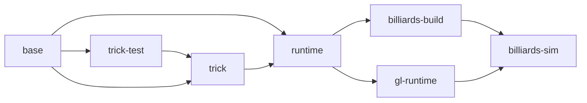

# How to "Containerize" Trick With Docker

This HOWTO assumes that we are building our Docker images on a Linux system.
If using Mac or Windows, the translation should hopefully be fairly straightforward.

**Contents**

* [Prerequisites](#Prerequisites)
* [Example Containerized Trick Environment](#a-basic-trick-environment)
* [Compiling and Running a Containerized Trick Simulation](#containerize-a-trick-simulation)

***

## Prerequisites:

* [Docker is installed on your machine](https://docs.docker.com/engine/install/). All the examples described in this article will work with any version of Docker that supports BuildKit (the default builder as of Docker 23).
* A basic familiarity with Docker. ["A Docker Tutorial for Beginners"](https://docker-curriculum.com) is an excellent way.
* A basic familiarity with bash shell scripting.
* At least 5 GB of Disk space available as bare minium.
* [Optional] If you wish to desire to experiment with GPU accelerated virtual desktops in trick sim containers, only a Linux host is currently supported.

<a id=a-basic-trick-environment></a>

## Example Containerized Trick Environment

A basic containerized trick environment is included with the trick git repository.
To get started, clone the trick repository to your host.

### Architecture

The build and runtime of the container based deployment is contained in 2 main places:

- **Makefile**: commands `run-docker` and `run-docker-mesa` to build and interact with the dockerized trick environment.
- **infra** Folder: Here you will find Docker build files (*.Dockerfile), a docker-compose.yaml defining various build and runtime configurations, and misc scripts necessary to bootstrap a containerized XFCE Desktop Environment. 

#### run-docker Command

Example: `make run-docker target=trick-test os=ubuntu2204`

`target` options

- `trick-test` runs trick unit and integration tests, and outputs junit test reports to folder `infra/test_reports`.
- `cli-runtime` starts a shell into a trick enabled environment. this environment can be used to develop, compile, and run simulations in a headless (no GUI), CLI only environment.
- `gui-runtime` starts a trick enabled Desktop environment accessible via a VNC virtual desktop session without requiring a GPU on the runtime host. 

`os` options

- `ubuntu2204` for Ubuntu 22.04
- `rocky8` for RockyLinux 8 

This command does not require the trick folder to have been initialized for build with `./configure`.


#### run-docker-mesa Command

This command is intended only to be used on Linux hosts which have a GPU available and working using the open source `mesa` GPU drivers.
It has been tested as functional on multiple modern AMD GPUs using the `amdgpu` mesa driver and should work with intel hardware with minimal modification if any.

Example: `make run-docker-mesa target_mesa=mesa-default-docker os=ubuntu2204`

`target_mesa` options

- `mesa-default-docker` if using the default, rootful docker context (run `docker context ls` if not sure).  
- `mesa-rootless-docker` if using the `rootless` docker context (run `docker context ls` if not sure).

`os` options

- `ubuntu2204` for Ubuntu 22.04
- `rocky8` for RockyLinux 8 

This command does not require the trick folder to have been initialized for build with `./configure`.

#### Image (re)build optimizations

The images have been organized into several layers, several of which can be built in parallel.
A "clean" rebuild of the system will typically involve a dependency tree which looks like the following diagram:



Since `base` is the root of all dependencies, we want it to change infrequently. 
This is where all common OS packages are installed, resulting in a size of ~2.4GB for Rocky 8 and ~1.96 for Ubuntu 22.04.

On the Ubuntu 22.04 image, the /var/cache/apt and /var/lib/apt are setup as special build cache mounts.
This is done with `--mount=type=cache` and `sharing=locked` as suggested by Docker. See also https://docs.docker.com/build/cache/.
The result is even if this layer needs to be re-built during local development, it can likely re-use the ~1GB of Debian dependencies needed for this step, instead of re-downloading them.

Only the ~300MB of "installed" trick dependencies are used for the `runtime` stage, saving ~300-600MB of space on the runtime image.
This is important because the `runtime` stage installs ~1GB of dependencies necessary to setup a local VNC server which runs a decently setup XFCE Desktop environment.
This is accomplished with the `COPY --link --from=trick /usr/local /usr/local` at the end of the `runtime` stage build.
This linkage is intentionally setup at the end of this stage so that re-builds of the trick binaries to not invalidate the cache of layers in the expensive to run `runtime` stage.

The `gl-runtime` and `billiards-build` are re-built in parallel after `runtime` is finished.

<a id=containerize-a-trick-simulation></a>
## Compiling and Running a Containerized Trick Simulation

## Introduction

In this example, we'll create a docker image from which we can run (a version of) ```SIM_cannon_numeric```,
one of the variants of Trick's Cannon Ball simulation. 
This image will be based on the Trick:19.5.1 image previously built.

Our containerized simulation won't start any variable server clients like the sim-control panel or graphics clients,  because we can't easily run graphics clients from __within__ the container. But, we __can__ easily connect graphics clients running on the host machine to our containerized simulation.

### Creating a Docker friendly version of ```SIM_cannon_numeric```


* Copy the ```SIM_cannon_numeric``` **S_define** file into the current directory.
     
   ```bash
   curl -O https://raw.githubusercontent.com/nasa/trick/19.5.1/trick_sims/Cannon/SIM_cannon_numeric/S_define
   ```
   
* Copy ```SIM_cannon_numeric``` include files.

   ```bash
   curl --create-dirs --output models/cannon/gravity/include/cannon.h \
   https://raw.githubusercontent.com/nasa/trick/19.5.1/trick_sims/Cannon/models/cannon/gravity/include/cannon.h
   curl --create-dirs --output models/cannon/gravity/include/cannon_numeric.h \
   https://raw.githubusercontent.com/nasa/trick/19.5.1/trick_sims/Cannon/models/cannon/gravity/include/cannon_numeric.h
   ```
   
* Copy ```SIM_cannon_numeric``` source files.

   ```bash
   curl --create-dirs --output models/cannon/gravity/src/cannon_init.c \
   https://raw.githubusercontent.com/nasa/trick/19.5.1/trick_sims/Cannon/models/cannon/gravity/src/cannon_init.c
   curl --create-dirs --output models/cannon/gravity/src/cannon_numeric.c \
   https://raw.githubusercontent.com/nasa/trick/19.5.1/trick_sims/Cannon/models/cannon/gravity/src/cannon_numeric.c
   ```
   
* Create a file named ```S_overrides.mk ``` that contains the following content:

   ```make
   TRICK_CFLAGS   += -Imodels
   TRICK_CXXFLAGS += -Imodels
   ```
   
* Create and enter a directory named ```RUN_demo``` and enter it:

   ```bash
   mkdir RUN_demo
   cd RUN_demo
   ```

* Create a file named ```input.py ``` that contains the following content:

   ```python
   trick.real_time_enable()
   trick.exec_set_software_frame(0.1)
   trick.itimer_enable()
   trick.var_server_set_port(9001)
   ```
   
   :exclamation: Notice that we are NOT starting a SIM-control-panel, or the graphics client.
   
   :exclamation: Notice that we are explicitly setting the variable server listen port.


### The Graphics Client

   Even though the simulation won't be starting the graphics clients, we will be starting and connecting the graphics clients to the containerized simulation.

   * Download the graphics client's source and Makefile.
  
   ```bash
   cd ${DOCKER_PLAYGROUND}/SIM_cannon_docker_build/SIM_cannon_docker
   curl --create-dirs --output models/graphics/src/CannonDisplay.java \
   https://raw.githubusercontent.com/nasa/trick/19.5.1/trick_sims/Cannon/models/graphics/src/CannonDisplay.java
   curl --create-dirs --output models/graphics/Makefile \
   https://raw.githubusercontent.com/nasa/trick/19.5.1/trick_sims/Cannon/models/graphics/Makefile
   ```

   * Down-load the graphics client's sound files.

   There are two sound files necessary to build the graphics client, 1)  **CannonBoom.wav**, and 2) **Explosion.wav** .
   They both need to be placed into ```models/graphics/resources/```.
   
   * Create the resources directory.
   
   ```
   mkdir -p models/graphics/resources
   ```
   * Download the sound files.
   
   Unfortunately, binary files are more difficult to down-load from Github than text files. 
   
   For each, we have to go to their respective Github pages and click the "Download" button.
   
   * Download CannonBoom.wav from [here](https://github.com/nasa/trick/blob/master/trick_sims/Cannon/models/graphics/resources/CannonBoom.wav).
     
   * Download Explosion.wav  from [here](https://github.com/nasa/trick/blob/master/trick_sims/Cannon/models/graphics/resources/Explosion.wav).

:exclamation: When you download the wave files from GitHub, their names may be set to a flattened version of their full pathnames. So, we have to rename them to their real names.
      
   * Rename the down-loaded wave files to **CannonBoom.wav**, and **Explosion.wav** respectively, and move them both to ```models/graphics/resources/```.


* Build the cannon graphics client.

   ```bash
   cd ${DOCKER_PLAYGROUND}/SIM_cannon_docker_build/SIM_cannon_docker/models/graphics
   make
   ```

### Building the Docker Image


  
### Running the docker image:
To instantiate a container from the image: ```docker run --name misterbill --rm -P sim_cannon_docker &```

* In a host terminal (not in the container) execute: 
  
  ```bash
  docker port misterbill
  ```
  
to see what host-port container-port 9001 has been mapped to.

You should see something like:

```
     9001/tcp -> 0.0.0.0:32783
     9001/tcp -> [::]:32783
```

This shows that port 9001 in our container has been mapped to port 32783
on our host computer.  So, in this case we would connect our (host)
java client to port 32783.

To connect the CannonDisplay variable-server client to the containerized simulation:

```bash
java -jar SIM_cannon_docker/models/graphics/dist/CannonDisplay.jar <port> &
```

:warning: Don't just copy and paste. If you don't put the right port number it won't work.


* Click **RELOAD**. This re-initializes the cannon. Then click **FIRE**. The cannon will fire.
* Adjust the controls on the left hand side of the graphics client.  **RELOAD** and **FIRE**.
* Do this until you're bored.

If Trick is installed on your host then you can also connect :

```bash
trick-simcontrol localhost <port> &
```

You can shut down the sim from the trick-simcontrol panel when you're done.
or if you don't have Trick installed, just use: ```docker kill misterbill```.


