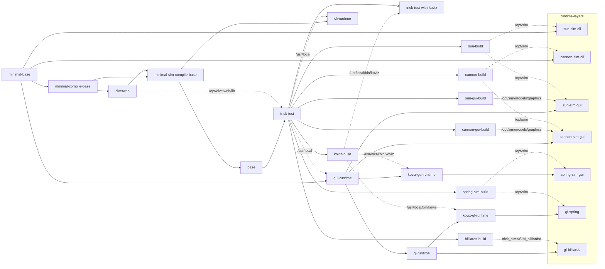
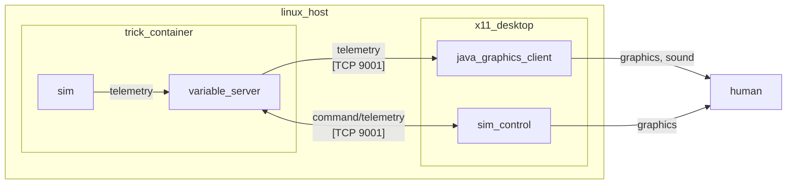
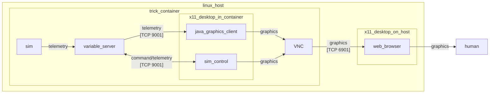
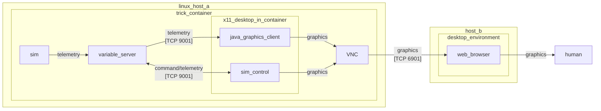
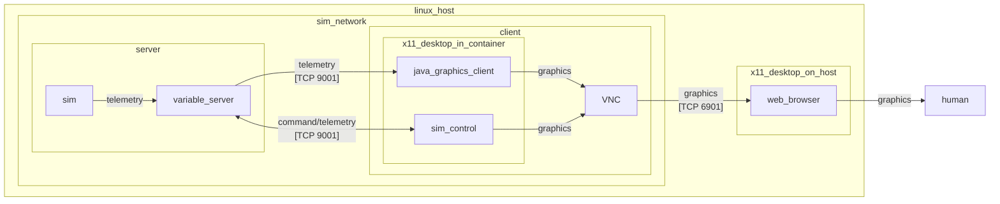
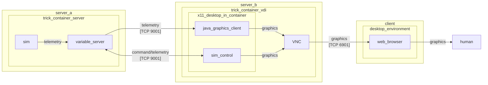
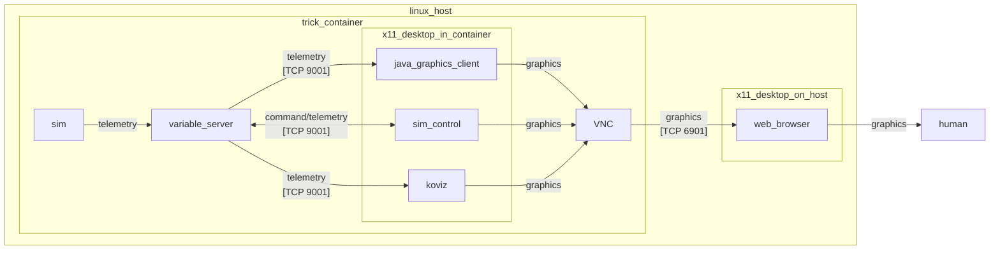

# How to "Containerize" Trick Sims With Docker

This HOWTO assumes that we are building our Docker images on a Linux system.
If using Mac or Windows, the translation should hopefully be fairly straightforward.

**Contents**

* [Prerequisites](#Prerequisites)
* [Example Containerized Trick Environment](#a-basic-trick-environment)
* [Compiling and Running a Containerized Trick Simulation](#containerize-a-trick-simulation)

***

## Prerequisites:

* [Docker is installed on your machine](https://docs.docker.com/engine/install/). All the examples described in this article will work with any version of Docker that supports BuildKit (the default builder as of Docker 23).
* A basic familiarity with Docker. ["A Docker Tutorial for Beginners"](https://docker-curriculum.com) is an excellent way.
* A basic familiarity with bash shell scripting.
* At least 5 GB of Disk space available as bare minium, with >20 recommended if exploring many examples in this document.
* [Optional] Setup docker in the [rootless mode](https://docs.docker.com/engine/security/rootless/). This is recommended for better security isolation. All examples in this article work for either rootless or the default rootful context.
* [Optional] If you desire to experiment with GPU accelerated virtual desktops in trick sim containers, only a Linux host is currently supported due primarily to current limits with a GPU accelerated docker context.
* [Optional] Install a VNC client on your linux host using a command like `sudo dnf install tigervnc`. This is optional and can be replaced with a web browser if desired.

<a id=a-basic-trick-environment></a>

## Example Containerized Trick Environment

A basic containerized trick environment is included with the trick git repository.
It is intended to provide a re-usable skeleton for setting up development environments for trick sims.
In this document, we will walk through setting up new sims within this environment.

To get started, clone the trick repository to your host.
The remainder of this guide will assume trick has been cloned to `~/src/trick`, 
  if not adjust the presented shell commands accordingly.

### Architecture

The build and runtime of the container based deployment is contained in 2 main locations:

- **Makefile**: commands `run-docker`, `run-docker-mesa`, and `run-docker-cluster`
  to build and interact with the dockerized trick environment.
- **infra** Folder: Here you will find Docker build files (*.Dockerfile),
  a docker-compose.yaml defining various build and runtime configurations, 
  and misc scripts necessary to bootstrap a containerized XFCE Desktop Environment. 

#### run-docker Command

This command is used to spin up single-container simulations and/or tests.

Example: `make run-docker target=trick-test os=ubuntu2204`

`target` options

- `trick-test` runs trick unit and integration tests, and outputs junit test reports to folder `infra/test_reports`.
- `cli-runtime` starts a shell into a trick enabled environment. this environment can be used to develop, compile, and run simulations in a headless (no GUI), CLI only environment.
- `gui-runtime` starts a trick enabled Desktop environment accessible via a VNC virtual desktop session without requiring a GPU on the runtime host. 
- `koviz-gui-runtime` starts a trick enabled Desktop environment accessible via a VNC virtual desktop session without requiring a GPU on the runtime host. Also has Koviz enabled for visualizations.

- `sun-sim-cli-runtime` - minimal headless sun sim runtime
- `sun-sim-gui-runtime` - graphical headless sim runtime
- `spring-sim-gui-runtime` - starts the spring sim without GPU acceleration

`os` options

- `ubuntu2204` for Ubuntu 22.04
- `rocky8` for RockyLinux 8 

This command does not require the trick folder to have been initialized for build with `./configure`.

#### run-docker-mesa Command

This command is intended only to be used on Linux hosts which have a GPU available and working using the open source `mesa` GPU drivers.
It has been tested as functional on multiple modern AMD GPUs using the `amdgpu` mesa driver and should work with intel hardware with minimal modification if any.

Example: `make run-docker-mesa target_mesa=mesa-default-docker os=ubuntu2204`

`target_mesa` options

- `mesa-default-docker` if using the default, rootful docker context (run `docker context ls` if not sure).  
- `mesa-rootless-docker` if using the `rootless` docker context (run `docker context ls` if not sure).

- `mesa-gl-billiards-sim-(default|rootless)-docker` - starts the billiards sim with GPU acceleration
- `mesa-gl-spring-sim-(default|rootless)-docker`  - starts the spring sim with GPU acceleration

`os` options

- `ubuntu2204` for Ubuntu 22.04
- `rocky8` for RockyLinux 8 

This command does not require the trick folder to have been initialized for build with `./configure`.

#### run-docker-cluster Command

This command will provision an isolated network to run a client+server simulation within.

Example `make run-docker-cluster target_profile=distributed-cannon-sim os=ubuntu2204`

`target_profile` options

- `distributed-cannon-sim` runs the distributed cannonball sim   

`os` options

- `ubuntu2204` for Ubuntu 22.04
- `rocky8` for RockyLinux 8 

#### Minified Sim Runtime images

These images are turn-key, ready to run for simulation activities.
They generally include compiled bins and not compilers.
These are intended mainly for distributed operations like CI and production deployment,
  with effort going into minifying the amount of dependencies on the image.

| IMAGE                            | Rocky 8 Size | Ubuntu 22.04 Size |
|----------------------------------|--------------|-------------------|
| nasatrick/mesa-gl-spring-sim     | 2.75GB       | 1.84GB            |
| nasatrick/mesa-gl-billiards-sim  | 2.70GB       | 1.95GB            |
| nasatrick/cannon-sim-gui-runtime | 2.29GB       | 1.73GB            |
| nasatrick/sun-sim-gui-runtime    | 2.27GB       | 1.71GB            |
| nasatrick/cannon-sim-cli-runtime | 572GB        | 376GB             |
| nasatrick/sun-sim-cli-runtime    | 555MB        | 359MB             |

#### Base images

These images are primarily intended to be the base for others not generally run on their own, unless deep in debugging.

| IMAGE                         | Rocky 8 Size | Ubuntu 22.04 Size | Description                                                                                         |
|-------------------------------|--------------|-------------------|-----------------------------------------------------------------------------------------------------|
| nasatrick/trick-test          | 4.04GB       | 3.21GB            | Everything needed to build and test trick sims                                                      |
| nasatrick/gui-koviz-runtime   | 2.52GB       | 1.78GB            | A virtual desktop which can run the koviz GUI.                                                      |
| nasatrick/mesa-gl-docker      | 2.45GB       | 1.70GB            | XFCE running on a containerized X server with VirtualGL GPU acceleration. Trick GUI apps installed. |
| nasatrick/cli-runtime         | 2.38GB       | 1.78GB            | Used to develop, compile, and run simulations in a headless (no GUI), CLI only environment          |
| nasatrick/gui-runtime         | 2.24GB       | 1.68GB            | XFCE running on a containerized X server. Trick GUI apps installed.                                 |

#### Image (re)build optimizations

The images have been organized into several layers, several of which can be built in parallel.
A "clean" rebuild of the system will typically involve a dependency tree which looks like the following diagram:



Since `base` is the root of all dependencies, we want it to change infrequently. 
This is where all common OS packages are installed, resulting in a size of ~2.4GB for Rocky 8 and ~1.96 for Ubuntu 22.04.

On the Ubuntu 22.04 image, `/var/cache/apt` and `/var/lib/apt` are setup as special build cache mounts on any `RUN` commands which do `apt install`.
This is done with `--mount=type=cache` and `sharing=locked` as suggested by Docker. See also https://docs.docker.com/build/cache/.
The result is even if this layer needs to be re-built during local development, it can likely re-use the ~1GB of Debian dependencies needed for this step.
Re-using local cache instead of re-downloading dependencies, saves over a minute in the re-build process.

Only the ~300MB of "installed" trick dependencies are used for the `runtime` stage, saving ~300-600MB of space on the runtime image.
This is important because the `runtime` stage installs ~1GB of dependencies necessary to setup a local VNC server which runs a decently setup XFCE Desktop environment.
This is accomplished with the `COPY --link --from=trick /usr/local /usr/local` at the end of the `runtime` stage build.
This linkage is intentionally setup at the end of this stage so that re-builds of the trick binaries to not invalidate the cache of layers in the expensive to run `runtime` stage.

The `gl-runtime` and `billiards-build` are re-built in parallel after `runtime` is finished.

The end result of this is a worst case scenario build time (from nothing to 3D enabled virtual desktop sim environment) is:
- Ubuntu 22.04 = ~3 minutes 43 seconds
- Rocky 8 = ~5 minutes 46 seconds

**System Restart time when no changes**: both OS runtimes are around ~3 seconds.

**System Restart time when changes to trick code or example sims**:
- Ubuntu 22.04 = ~2 minutes 16 seconds
- Rocky 8 = ~2 minutes 48 seconds

If we add trick_sims to the excluded directories at excluded from 
`COPY --link --exclude=infra --exclude=docs --exclude=*.Dockerfile . /opt/trick` in the `trick-sim` stage,
we can get even faster image restart times, at right around 1 minute.

Further optimizations could be made, including adding build caches to the trick code, so we may leverage cmake build caches to only rebuild the code that is necessary.
Given this build step is consistently ~75 seconds, this seems likely to have some significant positive improvement in image rebuild time. 

#### Deployment Architecture

Security hardening would need to be done before considering a production deployment of this system.
Some considerations include: not running as `root` wherever possible, changing away from default hardcoded `vncpassword` value, use of TLS/HTTPS, etc.
These security hardening tasks are often organization and project specific, and would be difficult to succinctly describe in this document.

Security hardening issues aside, the example deployment is intended to provide a base for the following SDLC (software development lifecycle) operations:
- **all images** = local build, test, run of trick sims
- **nasatrick/cli-runtime-{OS family}** = Machine interactions like CI or hardware in the loop verification, automated tests used in Flight Software development, etc.
- **nasatrick/gui-runtime-{OS family}** = Human interactions with desktop applications like virtual/hardware in the loop training.

<a id=containerize-a-trick-simulation></a>
## Compiling and Running a Containerized Trick Simulation

### Headless Trick Container Runtime

A headless environment is one which does not have a Graphical Desktop Environment available.
For example when SSHing into a remote session on a linux machine without X11 running.

In this example, we'll create a runtime context from which we can run (a version of) ```SIM_cannon_numeric```,
 one of the variants of Trick's example Cannon Ball simulation. 

Our containerized simulation won't start any variable server clients like the sim-control panel or graphics clients within the container.
The graphics clients are installed and run directly on the host machine and connected using docker networking to our containerized simulation.



#### Creating a Headless version of ```SIM_cannon_numeric```

Navigate to `/opt/trick_sims/Cannon/SIM_cannon_numeric`.

Create a new file under the `RUN_test` folder called `headless.py` that contains the following content:

```python
trick.real_time_enable()
trick.exec_set_software_frame(0.1)
trick.itimer_enable()
trick.var_server_set_port(9001)
```
   
   :exclamation: Notice that we are NOT starting a SIM-control-panel, or the graphics client.
   
   :exclamation: Notice that we are explicitly setting the variable server listen port.


#### The Graphics Client

Even though the simulation won't be starting the graphics clients within the container,
we will be starting the graphics clients on the host and connecting it to the containerized simulation.

To build the cannon graphics client run the following command on your host:

```bash
cd ~/src/trick/trick_sims/Cannon/models/graphics
make
```

  :exclamation: Notice this requires utilities on your host like java and make. If you don't have these, feel free to skip ahead to the next examples, which does not require these dependencies be directly installed on the host.

#### Building and Running the image

To instantiate a container from the image:

```bash
cd ~/src/trick
make run-docker os=ubuntu2204 target=cli-runtime
```

This command will build the Trick image (rebuilding layers to incorporate any changes as necessary).
Next, it will drop you into a shell on Trick container where you can command the lifecycle of the sim through CLI commands.
To facilitate exploration of `trick_sim` examples, it mounts the trick_sims folder to `/opt/trick_sims`.
To start the simulation run the following commands within the container:

```bash
cd /opt/trick_sims/Cannon/SIM_cannon_numeric
trick-CP
./S_main_Linux_*.exe RUN_test/headless.py
```

To connect the CannonDisplay variable-server client to the containerized simulation:

```bash
java -jar ~/src/trick/trick_sims/Cannon/models/graphics/dist/CannonDisplay.jar 9001 &
```


* Click **RELOAD**. This re-initializes the cannon. Then click **FIRE**. The cannon will fire.
* Adjust the controls on the left hand side of the graphics client.  **RELOAD** and **FIRE**.
* Do this until you're bored.

If Trick is installed on your host then you can also connect :

```bash
trick-simcontrol localhost 9001 &
```

You can shut down the sim from the trick-simcontrol panel when you're done.
or if you don't have Trick installed, you can end the Container spawned with the `make run-docker` command by:
- "ctrl + c" to stop the simulation. You may need to enter this twice or more.
- "ctrl + d" to exit the shell session, which will also stop the  Container spawned.

### Containerized X11 Trick Runtime

An isolated, containerized X11 Desktop Environment setup for Trick is also provided in the Trick Docker architecture.

This setup allows us to remotely or locally interact with a Trick instance's sim control without requiring any client installed locally, except VNC client or a web browser.

It also scales well to multi or single machine deployment configurations and container orchestration technologies. See the following solution architecture diagrams for more info:

#### Example Single machine Deployment



#### Example Multiple machine Deployment



#### Example using "Lunar Lander" Simulation

In this example, we will use the containerized X11 Trick Runtime to control the Lunar Lander simulation provided in trick sim examples.

First you will need to amend the Dockerfile, e.g. `infra/ubuntu2204.Dockerfile`. Add to the end 4 target like the following:

```Dockerfile

####### Cannon distributed sim example with Minimal Headless Runtime image and Virtual Desktop Images both delivered
FROM trick-test as lander-build
COPY "./trick_sims/SIM_lander" /opt/sim
RUN cd /opt/sim && trick-CP

FROM trick-test as lander-gui-build
COPY "./trick_sims/SIM_lander/models/graphics" /opt/sim/models/graphics
RUN cd /opt/sim/models/graphics && make

FROM gui-runtime as lander-sim-gui-runtime
COPY --chown=1000:1000 --from=lander-build /opt/sim /home/trick/sim
COPY --chown=1000:1000 --from=lander-gui-build /opt/sim/models/graphics /home/trick/sim/models/graphics
WORKDIR /home/trick/sim

```
   :exclamation: Notice this is nearly identical to other example sim runtimes such as the distributed cannon sim.

Next, add a new docker-compose service to `infra/docker-compose.yaml`, e.g:

```yaml
services:
  #... other services 
  #### Lander sim
  lander-sim-gui-runtime:
    image: nasatrick/lander-sim-gui-runtime-${OS_ID}
    extends:
      service: gui-runtime
    build:
      target: lander-sim-gui-runtime
```

Finally, on your linux host initiate the run command:

```shell

cd ~/src/trick
make run-docker os=ubuntu2204 target=lander-sim-gui-runtime

```

Notice that this build is much faster than the initial build, as only changed layers are re-built.

You should see logs output stating VNC is ready to connect like the following:

```

------------------ VNC environment started ------------------

VNCSERVER started on DISPLAY= :1 
        => connect via VNC viewer with 172.18.0.2:5901

noVNC HTML client started:
        => connect via http://172.18.0.2:6901/?password=...

```

There are 2 options to connect to the desktop:
- Open a browser and go to `http://localhost:6901/?password=vncpassword`
- In the VNC viewer installed locally, connect to `http://localhost:5901` with password `vncpassword`

You should land in a virtual desktop session to the containerized Trick Desktop running.

To start the sim, open a terminal (via the mouse icon in the upper left corner of the virtual desktop)

Run the following commands within the virtual desktop:

```shell
cd ~/sim
./S_main*.exe RUN_test/input.py
```

Sim Control and Lander Visualization windows will launch within the virtual desktop.

To stop the container, send a "ctrl + c" kill signal in the shell used to launch `make run-docker` initially. 

#### Example using "Billiards" Simulation and GPU acceleration

By default, when rendering an X11 server within a container, all rendering is done with software instead of the GPU.
For 3D applications leveraging GLX or similar GPU acceleration technologies, this can lead to very high CPU use.
This is demonstrated with the "Billiards" simulation, which leverages 3D acceleration for render when available.

An example leveraging technology [VirtualGL](https://github.com/VirtualGL/virtualgl) is provided,
  as well as runtime configurations for common mesa configurations (modern AMD or Intel GPUs).
Nvidia GPUs will also work with this technology through the [NVIDIA Container Runtime](https://developer.nvidia.com/container-runtime),
 though this implementation is left to the reader.

Note this setup is quite finicky with some host hardware and OS having better support than others.

Before we begin the run, inspect the following layers in the Dockerfile at `~/src/trick/infra/ubuntu2204.Dockerfile`:
- gl-runtime
- billiards-build
- billiards-gl-runtime

In `gl-runtime`, we install and setup VirtualGL. 
Note we also setup the default XFCE xsession to utilize the `vglrun` wrapper command.
In most host situations, this should make it such that the entire desktop and any screens launched within are rendered by the GPU.

In `billiards-build`,  we install all dependencies needed to do the compile and compile the sim and its associated GUI.

Finally, in `billiards-sim` we make the compiled sim available at `/home/trick/trick_sims/SIM_billiards`

This is an example of a slimmed runtime image which is optimized for delivery to end users, as we do not waste space including unnecessary dev dependencies only used in the build context.

To run this, first identify your docker context.
Run command `docker context ls`. The output indicates whether you are using the `default` or `rootless` contexts.

- If in `default context`, run `make run-docker-mesa target_mesa=mesa-gl-billiards-sim-default-docker os=ubuntu2204`.

- Else if in `rootless context`, run `make run-docker-mesa target_mesa=mesa-gl-billiards-sim-rootless-docker os=ubuntu2204`

Connect to the virtual desktop as in the previous example.

To start the sim, open a terminal (via the mouse icon in the upper left corner of the virtual desktop).

Run the following commands within the virtual desktop:

```shell
cd ~/trick_sims/SIM_billiards
vglrun ./S_main*.exe RUN_break/input.py
```

A 3D render of a pool table should launch and use the GPU for rendering.
In practice, using the GPU for sims like this can save several CPU cores which would otherwise be used by llvmpipe for CPU rendering.

If vglrun exits complaining with a message like invalid EGL device, there is likely some host or docker runtime limitation blocking 3D rendering.
To work around this, remove the `vglrun` part of the command:

```shell
cd ~/trick_sims/SIM_billiards
./S_main*.exe RUN_break/input.py
```

The performance will likely be worse, as this will use strictly software rendering for the GL calls.

#### Example using "Cannon" Simulation, utilizing a distributed architecture and civetweb

In this example, we will run the Cannon example in a distributed, multi-container, server-client architecture using docker-compose service orchestration.

First, we will need to make a minor code change to support this distributed sim.

In trick_sims/Cannon/models/graphics/src/CannonDisplay, find the line where the host is set to `localhost`.
We will want instead to use the docker-compose DNS networking to refer to our server, so we may communicate with it over the docker-compose defined sim network.
The DNS name should be a value like `cannon-sim-server-runtime`.

After modifying the graphics utility, on your linux host initiate the run command:

```shell

cd ~/src/trick
make run-docker-cluster os=ubuntu2204 target_profile=distributed-cannon-sim

```

Connect to the virtual desktop using the same process described in previous examples.

To start the sim, open a terminal (via the mouse icon in the upper left corner of the virtual desktop)

Run the following commands within the virtual desktop:

```shell
java -jar /home/trick/sim/models/graphics/dist/CannonDisplay.jar 9001 &
```

The Cannon Control UI will be launched within the virtual desktop. 
The fire and reload buttons can now be used to remotely control the cannon simulation from within the virtual desktop session.

The trick-simcontrol utility can also be launched by opening a terminal from within the virtual desktop and running:

```shell
trick-simcontrol 
```

Once launched, enter the host:port value `cannon-sim-server-runtime:9001`.

To stop the container, send a "ctrl + c" kill signal in the shell used to launch `make run-docker` initially. 

System architecture diagrams for this client-service architecture follow: 

##### Example Single machine Deployment



##### Example Multiple machine Deployment

While not provided in the example, the pattern could be expanded to a multi-machine distributed system looking something like this:



#### Example using "Spring" Simulation, utilizing Koviz for visualization

In this example, we will run the Spring example provided by Koviz.


```shell

cd ~/src/trick
make run-docker-mesa os=ubuntu2204 target_mesa=mesa-gl-spring-sim-default-docker
```

Connect to the virtual desktop using the same process described in previous examples.

There are 2 runtime modes provides in the koviz example:
1. Monte carlo
2. Realtime variable monitoring

Both can be launched from the same container, and through use of the VirtualGL GPU accelerated Desktop and QT, do not require explicit use of the `vglrun` wrapper command.  

##### Spring Monte Carlo Visualizations

Open a terminal and run:

```shell
cd ~/koviz/sims/SIM_spring
./S_main_*.exe RUN_test/input.py
koviz MONTE_RUN_test
```

##### Realtime sim Variable Monitoring

First, you may want to modify the sim to have a greater timeout.
This can be modified in the running container at `~/sims/SIM_spring/RUN_realtime/input.py`

Next, start the sim:

```shell
cd ~/koviz/sims/SIM_spring
./S_main_*.exe RUN_realtime/input.py
```

In another terminal session, start the koviz application:

```shell
cd ~/koviz/sims/SIM_spring
koviz RUN_realtime -trickport 4545
```

Start the sim using the trick sim control and explore the live data graphs using the TV and/or Vars tabs.

To stop the container, send a "ctrl + c" kill signal in the shell used to launch `make run-docker` initially. 

System architecture diagrams for this client-service architecture follow: 



This example provides VirtualGL, which can be used to render a Blender install running from within the container.
While not provided in this example, Blender could be integrated with Koviz as described in the Koviz User Guide.